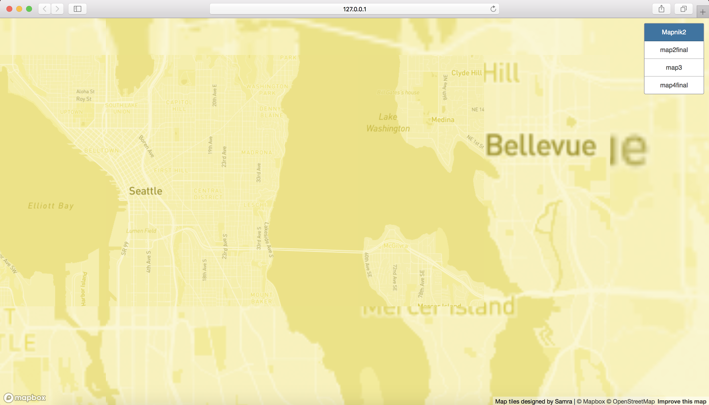
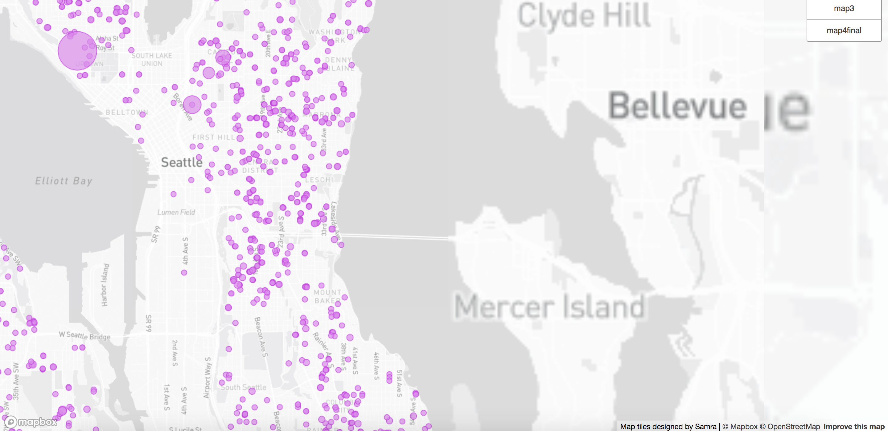
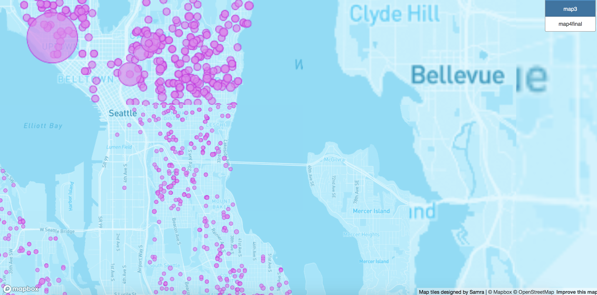
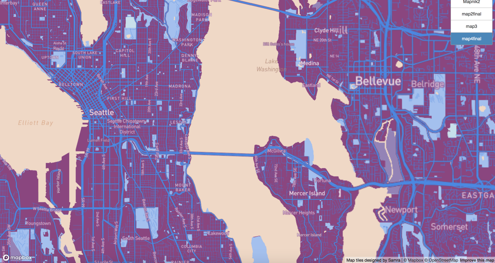

# lab4_
the url to access the web map you have made.
[map1](index.html)

screenshots of the four layers (2 POINTS)
screenshot 
screenshot 
screenshot 
screenshot 

the examined geographic area, and (2 POINTS)
The examined geographic location I selected is Seattle, Washington.

the available zoom levels of each tile is set to 10.

The tile set labeled Mapnik2 displays a base map.
The tile set labeled map2final displays a greyscale map with one dataset containing residential building permits not yet completed.
The tile set labeled map 3 provides both a base map and the dataset containing residential building permits not yet completed.
The tile set labeled map4final displays an aesthetically appealing map that is themed using the colorway adopted from the autism awareness logo.